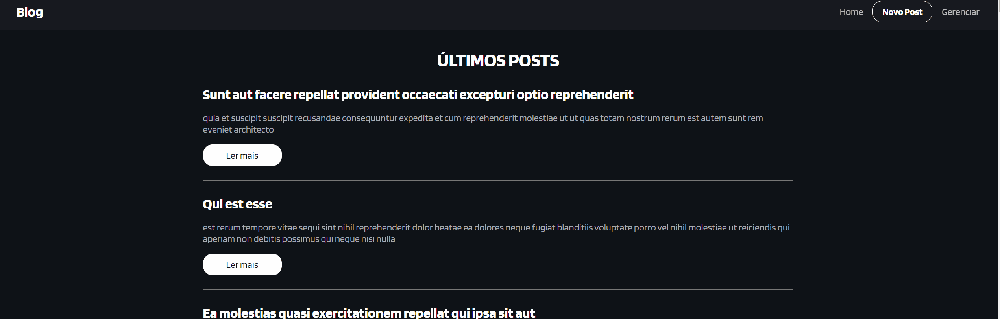

# Blog axios


## Funcionalide 
[]

---

## Como usar

```
git clone https://github.com/rjunio98/blog-react-axios

```

```
cd blog-react-azios
```

```
npm install
```

```
npm start
```


## Objetivo
É um projeto baseado em react, consite em um blog onde tem a página Home que faz um get na API. Tem outra página novo post que pode criar um post E outra página gerenciar que vai ter a opção de excluir e editar o post escolhido.

- React-icons
- React-router-dom
- React Hooks
- Integração com API axios
- HTML
- FlexBox
- Manipulação de objetos/array JS

---

## Tecnologias utilizadas

- HTML
- CSS
- ReactJs
- Integração com API
- Git